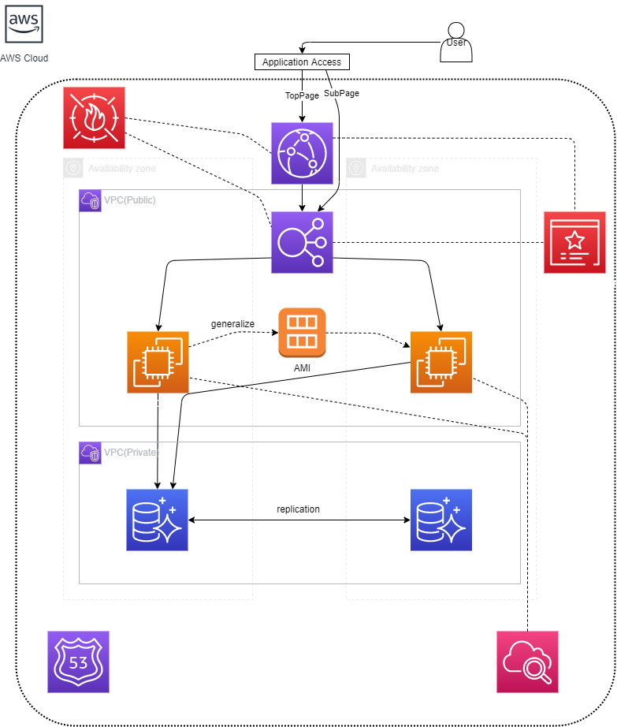

# TechTask

## WordPress_Multi_AZ

[CloudFormation Template](CloudFormation/WordPress_Multi_AZ/template.yaml)

### 構成図

---

## Wordpress

### Past changes to supported PHP versions have been as followed:

    In WordPress version 4.1: Added support for PHP 5.6.
    In WordPress 4.4: Added support for PHP 7.0 (dev note).
    In WordPress 4.7: Added support for PHP 7.1.
    In WordPress 4.9: Added support for PHP 7.2.
    In WordPress 5.0: Added support for PHP 7.3 (dev note).
    In WordPress 5.2: Dropped support for PHP 5.2, 5.3, 5.4, 5.5.
    In WordPress 5.3: Added support for PHP 7.4 (dev note).
    In WordPress 5.6: Added “beta support” for PHP 8.0 (dev note).

## Elastic Beanstalk

- PaaS サービス
  - 
- [設計上の考慮事項](https://docs.aws.amazon.com/ja_jp/elasticbeanstalk/latest/dg/concepts.concepts.design.html)

## Lightsail

Bitnami Wordpress インスタンスをすぐに作成できる
ただしスケールアップ時に停止が必要

### 構築メモ

- Lightsail インスタンスを Wordpress イメージで作成
  - セキュリティ設定の通信元を自宅作業用 IP アドレス，オフィスネットのアドレスに変更
- IP アドレスを静的に変更
- Route 53 にカスタムドメインを追加 A レコード
- ロードバランサー作成
- 証明書作成
- Route53 に証明書の名前と値を CNAME として登録
- マルチ AZ でデータベース作成
- Lightsail インスタンスの wordpress 設定の DB 接続情報を作成したデータベースに変更
- Lightsail ディストリビューションを作成
- 証明書を作成
- Route53 に証明書の名前と値を CNAME として登録

---

## Best Practice

1. スケーラビリティの確保(reliability)

   - EC2 Auto Recovery
   - EC2 Auto Scailing
   - Cloud Watch
   - RDS
   - DynamoDB

1. 環境の自動化

   - Cloud Formation
   - Code シリーズ
   - ECS
   - Elastic Beanstalk
   - OpeWorks
   - Cloud Watch

1. 使い捨てリソースの使用

   - EC2
   - Auto Scaling

1. コンポーネントの疎結合

   - ELB
   - SNS
   - SQS

1. サーバーではなくサービス（サーバレス）

   - Lamda
   - SNS
   - SQS
   - ELB
   - SES
   - DynamoDB
   - Amazon API Gateway
   - Amazon Cognite

1. 最適なデータベース選択

   - RedShift
   - RDS
   - DynamoDB
   - Aurora
   - Elasticsearch

1. 増大するデータ量対応

   - S3
   - Kinesis
   - Glacier

1. 単一障害点の排除

   - アーキテクチャで高可用性を実現すべきサービス
     - EC2
     - Direct Connect
   - 利用する主要サービス
     - ELB

1. コスト最適化

   - 需要と供給の一致
     - Auto Scaling
   - コスト効率の高いリソース
     - EC2 購入方式
     - Trusted Advisor
   - 支出の認識
     - Cloud Watch
     - SNS
   - 継続した最適化
     - AWS 最新情報
     - Trusted Advisor

1. キャッシュの利用

   - CloudFront
   - ElastiCache

1. セキュリティの確保

   - データ保護
     - ELB
     - EBS
     - S3
     - RDS
     - KMS
   - 権限管理
     - IAM
     - MFA
   - インフラ保護
     - VPC
   - 検出制御
     - Cloud Trail
     - AWS Config
     - Cloud Watch